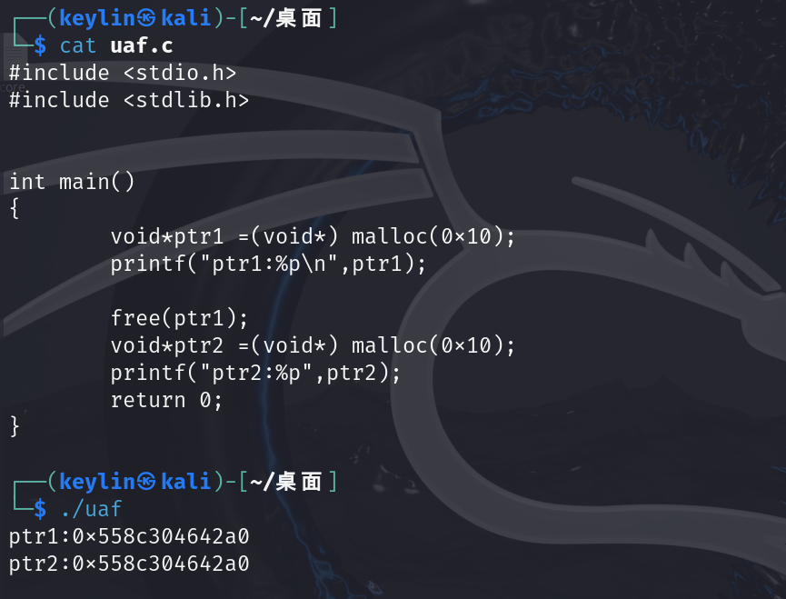

本篇博客是对PolarD&N中Pwn方向题目的讲解，前面会先介绍一些基础的知识再结合题目进行演示，并以此记录我的第一篇博客，如有不足之处请谅解。

# use after free（UAF)

use after free 是堆中常见的漏洞，也是属于比较简单的堆题，出现漏洞的原因是由于free()函数执行后并没有将目标指针重新设置为零，造成出现野指针的现象，这时就能通过再次申请相同大小的堆块获得之前申请过的该大小的堆块，这样我们可以对该堆块的内容进行改写比如改成后门函数的地址，如果程序执行该处的内容就能获得shell

下面以一个简单的c程序演示，先放上代码

```
#include <stdio.h>
#include <stdlib.h>

int main()
{
	void*ptr1 =(void*) malloc(0x10);	
	printf("ptr1:%p\n",ptr1);
	

	free(ptr1);
	void*ptr2 =(void*) malloc(0x10);
	printf("ptr2:%p",ptr2);
	return 0;

}
```

可以看到我释放了ptr1但没有将指针清零导致构成UAF漏洞，当再次申请相同的0x10堆块给ptr2时，由于ptr1未被置零则ptr2拿到与ptr1相同的堆块即ptr2=ptr1



实例：like_it


